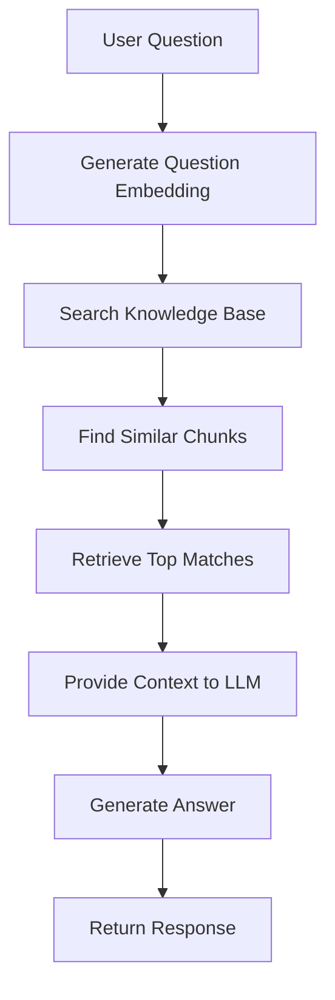

# Lesson 2, Part 1: Introduction to RAG

This is the first part of learning how to build a Retrieval-Augmented Generation (RAG) system for manufacturing knowledge bases. You'll understand what RAG is, why it's valuable, and how it enables semantic search over manufacturing documentation.

## Learning Objectives

By the end of this part, you will:
- [ ] Understand what RAG is and how it works
- [ ] Know why RAG is important for manufacturing knowledge bases
- [ ] Understand the RAG process: chunking, embedding, and retrieval
- [ ] Recognize use cases for RAG in manufacturing

## What is RAG?

**RAG** stands for **Retrieval-Augmented Generation**. In simple terms, RAG is the process of providing a Large Language Model (LLM) with specific information relevant to the prompt.

### Why is RAG Important?

While LLMs are powerful, the information they can reason on is restricted to the data they were trained on. This problem becomes apparent when asking an LLM for information outside of their training data, like:

- Proprietary manufacturing specifications
- Company-specific procedures
- Material charts and codes
- Production guidelines that change over time

RAG solves this problem by:
1. **Storing** your manufacturing knowledge in a searchable format
2. **Finding** relevant information when a question is asked
3. **Providing** that information as context to the LLM
4. **Generating** accurate responses based on your actual knowledge base

## The RAG Process

RAG works in three main steps:

### 1. Chunking
Break down large documents into smaller, searchable pieces (chunks).

### 2. Embedding
Convert each chunk into a vector (embedding) that represents its semantic meaning.

### 3. Retrieval
When a user asks a question:
- Convert the question to an embedding
- Find chunks with similar embeddings (cosine similarity)
- Return the most relevant chunks as context

## Why RAG for Manufacturing?

Manufacturing knowledge bases contain:

- **Material specifications** - Steel grades, properties, dimensions
- **Material charts** - Code mappings, specifications
- **Production procedures** - SOPs, quality control, safety guidelines
- **Troubleshooting guides** - Problem-solving documentation

**The Challenge**: Operators and engineers need quick access to this information, but:
- Documents are long and hard to search
- Keyword search misses semantic meaning
- Information is scattered across multiple files

**The Solution**: RAG enables:
- **Semantic search** - Find information by meaning, not just keywords
- **Natural language queries** - Ask questions naturally
- **Accurate answers** - Based on your actual documentation
- **Always up-to-date** - Add new documents to the knowledge base

## Use Cases in Manufacturing

### 1. Material Specification Lookup

**Question**: "What are the properties of SS316 steel?"

**RAG Process**:
1. Question is embedded
2. System finds relevant chunks from material specs
3. LLM generates answer using those chunks

### 2. Procedure Guidance

**Question**: "How do I handle a quality issue with thickness variation?"

**RAG Process**:
1. Finds relevant troubleshooting and procedure chunks
2. Provides step-by-step guidance from your SOPs

### 3. Material Code Mapping

**Question**: "What material code should I use for 5mm SS304?"

**RAG Process**:
1. Searches material charts
2. Finds the correct code mapping
3. Provides accurate answer

## How RAG Differs from Simple Search

| Traditional Search | RAG |
| ----------------- | --- |
| Keyword matching | Semantic understanding |
| Exact text match | Meaning-based match |
| Misses synonyms | Understands variations |
| No context | Provides context to LLM |
| Static results | Generates answers |

## The Complete RAG Flow

## What You'll Build

In this lesson, you'll build a RAG system that:

1. **Chunks** manufacturing documents (material specs, charts, procedures)
2. **Generates embeddings** for each chunk
3. **Stores embeddings** in JSON format (simple, no database needed)
4. **Searches** using cosine similarity
5. **Answers questions** using retrieved context

## Key Concepts Preview

### Embeddings

Embeddings are vector representations of text that capture semantic meaning. Similar concepts have similar embeddings.

### Cosine Similarity

A mathematical measure of similarity between two vectors. Values range from -1 to 1, where 1 means identical meaning.

### Chunking Strategy

How you break documents into chunks affects search quality. We'll use sentence-based chunking for manufacturing docs.

## Check Your Understanding

Before moving on, make sure you can:

- [ ] Explain what RAG is and why it's useful
- [ ] Understand the three main steps: chunking, embedding, retrieval
- [ ] Identify at least two manufacturing use cases for RAG
- [ ] Understand how RAG differs from traditional keyword search

## Try It Yourself

- Think about your domain: What knowledge base would benefit from RAG?
- Consider: What questions would operators/engineers ask that RAG could answer?

## Summary

In this part, you learned:

- **RAG** provides LLMs with relevant context from your knowledge base
- **RAG enables** semantic search over manufacturing documentation
- **The process** involves chunking, embedding, and retrieval
- **Use cases** include material specs, procedures, and troubleshooting

In the next part, you'll learn how to chunk manufacturing documents effectively.

---

**Previous**: [Lesson 1, Part 4: Forecasting](./01-invisible-ai-part4-forecasting.md)  
**Next**: [Part 2: Chunking](./02-rag-part2-chunking.md)

