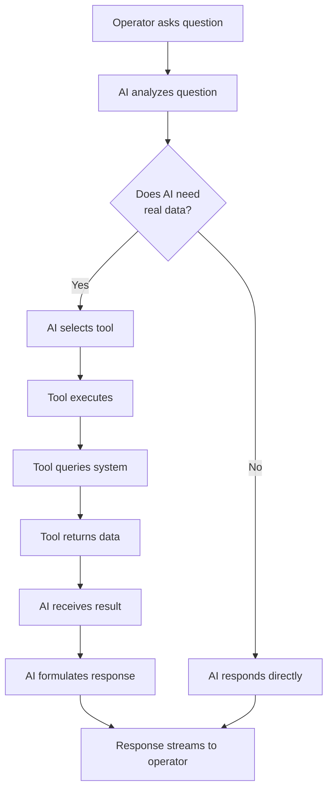

# Lesson 3, Part 3: Tool Calling

In this part, you'll learn how to enable the AI to execute functions (tools) to fetch real-time data from manufacturing systems, making the chatbot actually useful.

## Learning Objectives

By the end of this part, you will:
- [ ] Understand what tool calling is and why it's important
- [ ] Learn how to define tools with Zod schemas
- [ ] Create tools for querying production and work order data
- [ ] See tool calls in action

## What is Tool Calling?

**Tool calling** allows the AI to execute functions (tools) to fetch real-time data from your systems. Instead of the AI making up answers, it can query your actual MES, production, and quality systems.

### Basic Tool Calling Flow



## Creating Tools

**File**: `app/manufacturing/tools/getWorkOrderStatus.ts`

```typescript
import { tool } from "ai";
import { z } from "zod";

export const getWorkOrderStatus = tool({
  description:
    "Get the current status and progress of a work order from the MES system. Can find orders by work order ID (various formats like WO-12345, #67890, ORD-2024-001) or by customer name.",
  inputSchema: z.object({
    workOrderId: z
      .string()
      .optional()
      .describe("The work order ID to query (e.g., WO-12345, #67890). Can be partial."),
    customerName: z
      .string()
      .optional()
      .describe("Customer or company name to search for work orders"),
  }),
  execute: async ({ workOrderId, customerName }) => {
    // In production, this would query your MES API
    // For now, simulate with sample data
    const mockData: Record<string, any> = {
      "WO-12345": {
        workOrderId: "WO-12345",
        status: "in_progress",
        progress: 65,
        productGrade: "SS304",
        quantity: 500,
        customerName: "ABC Manufacturing",
        expectedCompletion: "2024-01-15T14:00:00Z",
        currentStage: "Hot Rolling",
      },
      // ... more mock data
    };

    // Search logic (handles various formats and partial matches)
    if (customerName && !workOrderId) {
      const found = Object.values(mockData).find((wo: any) =>
        wo.customerName?.toLowerCase().includes(customerName.toLowerCase())
      );
      return found || { error: `No work order found for customer: ${customerName}` };
    }

    if (workOrderId) {
      // Normalize and search
      const normalizeId = (id: string) => id.toLowerCase().replace(/[#\s-]/g, "");
      const normalizedQuery = normalizeId(workOrderId);
      
      const exactMatch = Object.keys(mockData).find(
        (key) => normalizeId(key) === normalizedQuery
      );
      if (exactMatch) return mockData[exactMatch];

      const partialMatch = Object.keys(mockData).find(
        (key) => normalizeId(key).includes(normalizedQuery) ||
                 normalizedQuery.includes(normalizeId(key))
      );
      if (partialMatch) return mockData[partialMatch];

      return { error: `Work order ${workOrderId} not found` };
    }

    return { error: "Please provide either work order ID or customer name" };
  },
});
```

## Adding Tools to API Route

**File**: `app/api/chat/route.ts` (updated)

```typescript
import { convertToModelMessages, streamText, UIMessage } from "ai";
import { getWorkOrderStatus } from "@/app/manufacturing/tools/getWorkOrderStatus";
import { getProductionStatus } from "@/app/manufacturing/tools/getProductionStatus";

export const maxDuration = 30;

export async function POST(req: Request) {
  const { messages }: { messages: UIMessage[] } = await req.json();

  const result = streamText({
    model: "openai/gpt-4.1",
    system: `You are an AI assistant for a steel manufacturing plant. Help operators with:
- Production status queries (daily totals, efficiency, quality rates)
- Work order progress and status

Use the available tools to fetch real-time data when operators ask questions.
Always provide accurate, up-to-date information.
Be concise and use manufacturing terminology appropriately.`,
    messages: await convertToModelMessages(messages),
    tools: {
      getWorkOrderStatus,
      getProductionStatus,
    },
  });

  return result.toUIMessageStreamResponse();
}
```

## Displaying Tool Calls in UI

Update the chat UI to show tool calls:

```typescript
{message.parts?.map((part, i) => {
  if (part.type === "text") {
    return <p key={i}>{part.text}</p>;
  }
  
  if (part.type.startsWith("tool-")) {
    const toolName = part.type.replace("tool-", "");
    const hasResult = "result" in part && part.result !== undefined;
    
    return (
      <div key={i} className="text-xs p-2 bg-gray-100 rounded mt-2">
        <p className="font-semibold">
          {hasResult ? "Called" : "Calling"} tool: {toolName}
        </p>
        {hasResult && (
          <pre className="text-xs mt-1 overflow-auto">
            {JSON.stringify(part.result, null, 2)}
          </pre>
        )}
      </div>
    );
  }
  
  return null;
})}
```

## Key Concepts

### Tool Definition

Tools have three parts:
- **description** - Tells AI when to use the tool
- **inputSchema** - Zod schema defining parameters
- **execute** - Function that runs when tool is called

### Automatic Tool Selection

The AI automatically:
- Analyzes the question
- Decides which tool to use
- Extracts parameters from the question
- Calls the tool
- Uses results in the response

## Check Your Understanding

Before moving on, make sure you can:

- [ ] Explain what tool calling is and why it's useful
- [ ] Create a tool with proper schema and execution
- [ ] Add tools to the API route
- [ ] Display tool calls in the UI

## Try It Yourself

- **Create new tools**: Add tools for machine status, quality metrics
- **Test tool selection**: Ask questions and see which tools are called
- **Improve tool descriptions**: Make descriptions more specific

## Summary

In this part, you learned:

- **Tool calling** enables AI to fetch real-time data
- **Tools** are defined with descriptions, schemas, and execution functions
- **AI automatically** selects and calls appropriate tools
- **UI displays** tool calls and results

In the next part, you'll learn about multi-step execution for complex queries.

---

**Previous**: [Part 2: Basic Chat Interface](./03-conversational-ai-part2-basic-chat.md)  
**Next**: [Part 4: Multi-Step Execution](./03-conversational-ai-part4-multi-step.md)

