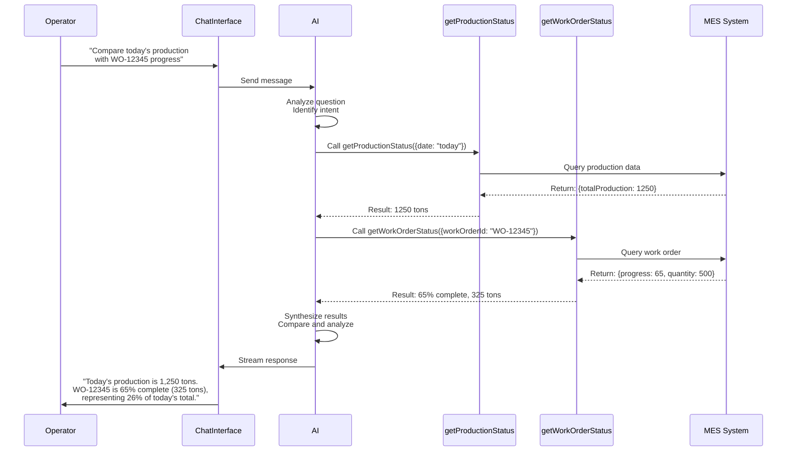

# Lesson 3, Part 4: Multi-Step Execution

In this final part, you'll learn how to enable multi-step execution, allowing the AI to call multiple tools in sequence to answer complex questions.

## Learning Objectives

By the end of this part, you will:
- [ ] Understand what multi-step execution is
- [ ] Learn how to enable multi-step execution
- [ ] See examples of tool chaining
- [ ] Understand best practices for tool design

## What is Multi-Step Execution?

**Multi-step execution** allows the AI to call multiple tools in sequence to answer complex questions. The AI can:
- Call a tool
- Receive the result
- Call another tool based on the first result
- Continue for multiple steps
- Generate a final response

## Enabling Multi-Step Execution

Add `stopWhen: stepCountIs(5)` to your API route:

**File**: `app/api/chat/route.ts` (updated)

```typescript
import { convertToModelMessages, streamText, stepCountIs, UIMessage } from "ai";
import { getWorkOrderStatus } from "@/app/manufacturing/tools/getWorkOrderStatus";
import { getProductionStatus } from "@/app/manufacturing/tools/getProductionStatus";

export const maxDuration = 30;

export async function POST(req: Request) {
  const { messages }: { messages: UIMessage[] } = await req.json();

  const result = streamText({
    model: "openai/gpt-4.1",
    system: `You are an AI assistant for a steel manufacturing plant. Help operators with:
- Production status queries (daily totals, efficiency, quality rates)
- Work order progress and status

Use the available tools to fetch real-time data when operators ask questions.
Always provide accurate, up-to-date information.
Be concise and use manufacturing terminology appropriately.`,
    messages: await convertToModelMessages(messages),
    tools: {
      getWorkOrderStatus,
      getProductionStatus,
    },
    stopWhen: stepCountIs(5), // Enable multi-step execution (up to 5 steps)
  });

  return result.toUIMessageStreamResponse();
}
```

## Multi-Step Examples

### Example 1: Sequential Calls

**Question**: "Compare today's production with yesterday and show me any delayed orders"

**Flow**:
1. Step 1: Call `getProductionStatus({ date: "today" })`
2. Step 2: Call `getProductionStatus({ date: "yesterday" })`
3. Step 3: Call `getWorkOrderStatus()` for active orders
4. Step 4: AI analyzes results and identifies delayed orders
5. Step 5: AI generates comprehensive response

### Example 2: Conditional Calls

**Question**: "If production is below 1000 tons today, show me which orders are behind schedule"

**Flow**:
1. Step 1: Call `getProductionStatus()` to check today's production
2. Step 2: AI receives result: `{ totalProduction: 850 }`
3. Step 3: Since condition is met (850 < 1000), AI calls `getWorkOrderStatus()` for active orders
4. Step 4: AI analyzes which orders are behind schedule
5. Step 5: AI generates response with delayed orders

## Visual Flow



## Best Practices for Tool Design

### 1. Clear Tool Descriptions

Tool descriptions guide the AI on when to use each tool:

```typescript
// Good: Clear and specific
description: "Get the current status and progress of a work order from the MES system. Can find orders by work order ID (various formats like WO-12345, #67890, ORD-2024-001) or by customer name.";

// Bad: Vague
description: "Gets work order data";
```

### 2. Flexible Parameters

Make parameters optional when possible:

```typescript
inputSchema: z.object({
  workOrderId: z.string().optional(), // Can search by ID
  customerName: z.string().optional(), // Or by customer name
});
```

### 3. Error Handling

Always handle errors gracefully:

```typescript
execute: async ({ workOrderId }) => {
  try {
    // Tool logic
    return result;
  } catch (error) {
    return { error: `Failed: ${error.message}` };
  }
};
```

### 4. Tool Granularity

Create focused tools rather than one large tool:

```typescript
// Good: Focused tools
getWorkOrderStatus(); // Gets one work order
getProductionStatus(); // Gets production data

// Bad: One tool that does everything
getAllData(); // Too broad
```

## Key Takeaways

### Core Concepts

- **Multi-step execution** enables complex queries requiring multiple data sources
- **Tool chaining** happens automatically based on question intent
- **Conditional execution** allows tools to be called based on previous results
- **Step limit** prevents infinite loops (5 steps is usually sufficient)

### Technical Implementation

- **`stopWhen: stepCountIs(5)`** enables multi-step execution
- **AI automatically determines** execution order
- **Tools can be called** sequentially, conditionally, or multiple times
- **Final response** synthesizes all tool results

## Check Your Understanding

Before moving on, make sure you can:

- [ ] Explain what multi-step execution is
- [ ] Know how to enable it in the API route
- [ ] Understand how tools can be chained
- [ ] Know best practices for tool design

## Try It Yourself

- **Test complex queries**: Ask questions requiring multiple tools
- **Observe tool chaining**: See how AI calls tools in sequence
- **Add more tools**: Create additional tools and see how AI uses them

## Summary

In this part, you learned:

- **Multi-step execution** allows AI to call multiple tools in sequence
- **Enable with** `stopWhen: stepCountIs(5)`
- **AI automatically** determines tool execution order
- **Best practices** ensure tools work well together

## Lesson 3 Complete!

Congratulations! You've completed Lesson 3: Conversational AI. You now know how to:

- ✅ Build chat interfaces with streaming
- ✅ Create tools for real-time data queries
- ✅ Enable multi-step execution for complex queries
- ✅ Design effective tools for manufacturing systems

**Course Complete!** 🎉

You've learned:
- **Lesson 1**: Invisible AI for automation
- **Lesson 2**: RAG for knowledge bases
- **Lesson 3**: Conversational AI for interactive systems

---

**Previous**: [Part 3: Tool Calling](./03-conversational-ai-part3-tool-calling.md)  
**Next**: [Deployment Guide](./04-deployment.md)

