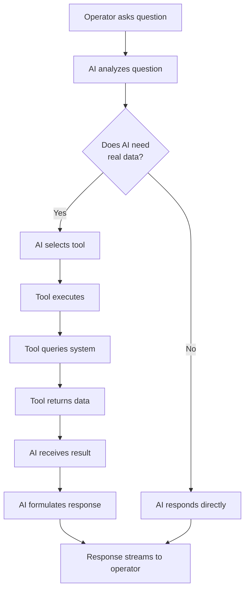
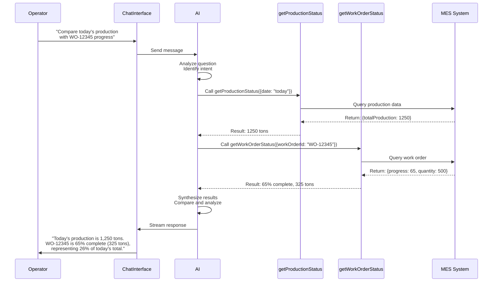

# Conversational AI: Operator Assistant

This guide demonstrates how to build a conversational AI assistant for steel manufacturing plant operators. You'll learn how to enable operators to ask questions about production status and work order progress using natural language.

## What is Conversational AI in Manufacturing?

Conversational AI enables operators to interact with production systems using natural language. Instead of navigating complex MES interfaces, operators can simply ask questions and get immediate answers.

In a steel manufacturing plant, this guide focuses on two key capabilities:

- **Answer questions about production status**: "How many tons did we produce today?", "What's the current efficiency?"
- **Query work order progress**: "What's the status of work order WO-12345?", "Is order #67890 on schedule?"

## The Current Workflow

Operators need quick access to production information:

1. **Production Status Queries**:

   - Check daily production totals
   - Monitor efficiency metrics
   - Review quality rates
   - Check machine status

2. **Work Order Queries**:
   - Find specific work order status
   - Check progress percentage
   - Verify delivery dates
   - Monitor order completion

**The Problem**: Traditional MES interfaces require:

- Multiple clicks and navigation
- Knowing where to find specific information
- Understanding complex menu structures
- Time-consuming searches through lists

**The Solution**: A conversational interface where operators simply ask: "What's the status of WO-12345?" or "How much did we produce today?"

---

## Where AI Excels: Specific Use Cases and Benefits

### 1. Natural Language Understanding for Production Queries

**The Challenge**: Operators ask questions in many different ways:

- "How many tons today?"
- "What's today's production?"
- "Show me production for January 15th"
- "Total output today?"

**Why Traditional Programming Fails**:

- **Keyword matching limitations**: Traditional search requires exact keywords. "production today" vs "today's production" might not match.
- **Rigid query structures**: Requires operators to learn specific query syntax or use dropdown menus.
- **No context understanding**: Can't understand follow-up questions like "What about yesterday?" after asking about today.
- **Limited flexibility**: Each variation requires separate code paths or complex regex patterns.

**How AI Solves This**:

- **Intent recognition**: Understands what the operator wants, regardless of how they phrase it.
- **Context awareness**: Remembers previous questions in the conversation.
- **Natural variations**: Handles synonyms, abbreviations, and different phrasings automatically.
- **Conversational flow**: Enables back-and-forth dialogue without rigid structures.

**Example**: Operator asks "How much did we make?" and AI understands they mean production quantity. Follow-up "What about quality?" is understood in context.

**Data Sources and How AI Uses Them**:

1. **Production Database**:

   - Daily production totals by shift
   - Production by product grade
   - Efficiency metrics
   - **How AI uses it**: Queries the database based on understood intent (today, yesterday, specific date, product type)

2. **Real-time Production Data**:

   - Current shift production
   - Live machine metrics
   - **How AI uses it**: Provides up-to-the-minute information when operators ask "current" or "right now" questions

3. **Historical Data**:
   - Past production patterns
   - Seasonal trends
   - **How AI uses it**: Enables comparisons like "How does today compare to last week?"

### 2. Work Order Status Queries

**The Challenge**: Operators need to check work order status quickly:

- Work orders have various ID formats (WO-12345, #67890, ORD-2024-001)
- Status information is scattered across multiple systems
- Progress updates happen in real-time
- Operators may not remember exact work order numbers

**Why Traditional Programming Fails**:

- **Exact match requirements**: Traditional search breaks if work order ID format varies slightly.
- **Multiple system queries**: Requires operators to know which system has which information.
- **No fuzzy matching**: Can't find orders if operator remembers partial ID or customer name.
- **Static interfaces**: Can't adapt to different ways operators ask about the same order.

**How AI Solves This**:

- **Flexible ID recognition**: Understands work order IDs in various formats and can find orders by partial matches.
- **Multi-source integration**: Automatically queries the right systems (MES, production, quality) to get complete information.
- **Fuzzy matching**: Can find orders by customer name, product type, or other attributes if ID is unclear.
- **Contextual responses**: Provides relevant information based on what the operator likely needs (status, progress, delivery date).

**Example**: Operator asks "Where's the ABC Manufacturing order?" and AI finds it by customer name, then provides full status including progress, expected completion, and any issues.

**Data Sources and How AI Uses Them**:

1. **MES System**:

   - Work order master data
   - Order status (planned, in_progress, completed, on_hold)
   - Customer information
   - Product specifications
   - **How AI uses it**: Primary source for work order details and status

2. **Production System**:

   - Real-time progress updates
   - Current production stage
   - Machine assignments
   - **How AI uses it**: Provides live progress percentage and current status

3. **Quality System**:

   - Quality check results
   - Defect information
   - Hold status
   - **How AI uses it**: Explains if order is delayed due to quality issues

4. **Planning System**:
   - Scheduled completion dates
   - Resource allocation
   - **How AI uses it**: Provides expected delivery dates and schedule information

**The AI Process**:

1. Understands the operator's question (work order ID, customer name, or other identifier)
2. Searches MES system for matching work orders (handles variations in ID format)
3. Retrieves current status from production system
4. Checks quality system for any holds or issues
5. Combines information from all sources
6. Presents a clear, conversational response with relevant details

## Why AI vs. Traditional Programming?

| Challenge             | Traditional Programming                            | AI Approach                                                   |
| --------------------- | -------------------------------------------------- | ------------------------------------------------------------- |
| **Query Variations**  | Requires exact keyword matching or complex regex   | Understands intent regardless of phrasing                     |
| **Context**           | Each query is independent                          | Remembers conversation context                                |
| **Fuzzy Matching**    | Exact matches only                                 | Finds orders by partial ID, customer name, or attributes      |
| **Multi-source Data** | Requires operators to query each system separately | Automatically queries and combines data from multiple systems |
| **Natural Language**  | Requires learning query syntax                     | Operators ask naturally, like talking to a colleague          |
| **Error Handling**    | Breaks on typos or variations                      | Handles typos, abbreviations, and variations gracefully       |
| **Learning**          | Static query patterns                              | Improves understanding from operator usage patterns           |

**Key Insight**: Traditional programming excels at **structured data retrieval with exact matches**. AI excels at **understanding natural language intent, handling variations, and providing conversational interfaces**—exactly what operators need for quick information access.

---

## Implementation: Operator Assistant Chatbot

### Step 1: Create the Basic Chat Interface

First, we'll create a simple chat interface using the AI SDK's `useChat` hook.

**File**: `app/(7-conversational-ai-manufacturing)/operator-assistant/page.tsx`

```typescript
"use client";

import { useChat } from "@ai-sdk/react";
import { useState } from "react";
import { Button } from "@/components/ui/button";
import { Input } from "@/components/ui/input";
import { Card, CardContent } from "@/components/ui/card";

export default function Page() {
  const [input, setInput] = useState("");
  const { messages, sendMessage, status } = useChat();
  const isLoading = status === "streaming" || status === "submitted";

  return (
    <div className="flex flex-col h-screen max-w-4xl mx-auto">
      <div className="p-4 border-b">
        <h1 className="text-2xl font-bold">Operator Assistant</h1>
        <p className="text-sm text-muted-foreground">
          Ask questions about production status, work orders, and equipment
        </p>
      </div>

      <div className="flex-1 overflow-y-auto p-4 space-y-4">
        {messages.length === 0 && (
          <div className="text-center text-muted-foreground py-12">
            <p className="mb-2">I can fetch real-time data for you:</p>
            <ul className="list-disc list-inside space-y-1 text-sm">
              <li>"What's the status of work order WO-12345?"</li>
              <li>"How many tons did we produce today?"</li>
              <li>"What's the efficiency?"</li>
              <li>"Where's the ABC Manufacturing order?"</li>
            </ul>
          </div>
        )}

        {messages.map((message) => {
          if (message.role === "user") {
            return (
              <div key={message.id} className="flex justify-end">
                <Card className="max-w-[80%] bg-primary text-primary-foreground">
                  <CardContent className="p-3">
                    <p className="text-sm whitespace-pre-wrap">
                      {message.parts?.find((p): p is { type: "text"; text: string } => p.type === "text")?.text || ""}
                    </p>
                  </CardContent>
                </Card>
              </div>
            );
          }

          // Assistant messages with parts
          return (
            <div key={message.id} className="flex justify-start">
              <Card className="max-w-[80%]">
                <CardContent className="p-3">
                  <div className="space-y-2">
                    {message.parts?.map((part, i: number) => {
                      if (part.type === "text") {
                        return (
                          <div key={`${message.id}-${i}`} className="text-sm whitespace-pre-wrap">
                            {part.text}
                          </div>
                        );
                      }
                      
                      // Handle tool parts - check if it's a tool-related part
                      if (part.type.startsWith("tool-")) {
                        // Extract tool name from type (e.g., "tool-getWorkOrderStatus" -> "getWorkOrderStatus")
                        const toolType = part.type.replace("tool-", "");
                        const toolName = toolType === "getWorkOrderStatus" ? "Work Order Status" : 
                                        toolType === "getProductionStatus" ? "Production Status" : 
                                        toolType;
                        
                        // Check if we have a result by looking at the part structure
                        const hasResult = "result" in part && part.result !== undefined;
                        const result = hasResult ? (part as { result: unknown }).result : null;
                        
                        return (
                          <div key={`${message.id}-${i}`} className="text-xs font-mono p-2 bg-gray-100 rounded border">
                            <p className="font-semibold mb-1">{toolName}</p>
                            {!hasResult ? (
                              <div className="flex items-center gap-2 text-muted-foreground">
                                <div className="animate-spin rounded-full h-3 w-3 border-b-2 border-gray-900"></div>
                                <span>Fetching data...</span>
                              </div>
                            ) : (
                              <pre className="text-xs overflow-auto">
                                {JSON.stringify(result, null, 2)}
                              </pre>
                            )}
                          </div>
                        );
                      }
                      
                      return null;
                    })}
                  </div>
                </CardContent>
              </Card>
            </div>
          );
        })}

        {isLoading && (
          <div className="flex justify-start">
            <Card>
              <CardContent className="p-3">
                <div className="flex items-center gap-2">
                  <div className="animate-spin rounded-full h-4 w-4 border-b-2 border-gray-900"></div>
                  <span className="text-sm text-muted-foreground">
                    Thinking...
                  </span>
                </div>
              </CardContent>
            </Card>
          </div>
        )}
      </div>

      <form
        onSubmit={async (e) => {
          e.preventDefault();
          if (!input.trim()) return;

          try {
            await sendMessage({ text: input });
            setInput("");
          } catch (error) {
            console.error("Failed to send message:", error);
          }
        }}
        className="p-4 border-t flex gap-2">
        <Input
          value={input}
          onChange={(e) => setInput(e.target.value)}
          placeholder="Ask about production status or work orders..."
          className="flex-1"
          disabled={isLoading}
        />
        <Button type="submit" disabled={isLoading || !input.trim()}>
          Send
        </Button>
      </form>
    </div>
  );
}
```

**Key Implementation Details**:

- **`useState` for input**: Manual input management for better control
- **`useChat()` without options**: The hook doesn't require an `api` option - it defaults to `/api/chat`
- **`status` instead of `isLoading`**: Use `status === "streaming" || status === "submitted"` to determine loading state
- **`sendMessage`**: Explicit message submission - no need to pass `api` option
- **`message.parts`**: Handles streaming responses with multiple parts (text and tool results)
- **Type-safe part handling**: Use type guards like `(p): p is { type: "text"; text: string }` for proper TypeScript support
- **Tool part handling**: Extract tool names from part types and check for results using `"result" in part`
- **Error handling**: Catches and logs errors during message submission

### Step 2: Understanding Tool Calling

**What is Tool Calling?**

Tool calling allows the AI to execute functions (tools) to fetch real-time data from your systems. Instead of the AI making up answers, it can query your actual MES, production, and quality systems.

**Basic Tool Calling Flow**:



**How It Works**:

1. **AI receives a question**: Operator asks "What's the status of WO-12345?"
2. **AI decides to use a tool**: The AI recognizes it needs real data and decides to call `getWorkOrderStatus`
3. **Tool executes**: The function runs and queries your MES system
4. **AI uses the result**: The AI receives the data and formulates a natural language response
5. **Response to operator**: "Work order WO-12345 is 65% complete, currently in Hot Rolling stage, expected completion on January 15th at 2 PM."

**Why Tool Calling Matters**:

- **Real-time data**: AI gets current information, not training data
- **System integration**: Connects AI to your actual manufacturing systems
- **Accuracy**: Ensures answers are based on real data, not AI hallucinations
- **Extensibility**: Add new tools to enable new capabilities

### Step 3: Multi-Step Execution

**What is Multi-Step Execution?**

The AI can call multiple tools in sequence to answer complex questions. This is called **multi-step execution** or **function calling chains**. To enable this, you must configure the `stopWhen` parameter in your API route.

**Enabling Multi-Step Execution**:

In your API route, add `stopWhen: stepCountIs(5)` to allow the AI to execute up to 5 steps:

```typescript
import { streamText, convertToModelMessages, stepCountIs } from "ai";

const result = streamText({
  // ... other config
  stopWhen: stepCountIs(5), // Enable multi-step execution (up to 5 steps)
});
```

This allows the AI to:

- Call a tool
- Receive the result
- Call another tool based on the first result
- Continue for up to 5 steps total
- Generate a final response

**Visual Flow Diagram**:



**Example: Complex Query Flow**

Operator asks: _"Compare today's production with the ABC Manufacturing order progress"_

**Step-by-step execution**:

1. **Step 1**: AI calls `getProductionStatus` to get today's production data
2. **Step 2**: AI calls `getWorkOrderStatus` with customer name "ABC Manufacturing" to find the order
3. **Step 3**: AI receives both results
4. **Step 4**: AI compares and synthesizes: "Today we've produced 1,250 tons. The ABC Manufacturing order (WO-12345) is 65% complete with 325 tons produced so far, which represents 26% of today's total production."

**How the AI Decides**:

The AI automatically determines:

- **Which tools to call**: Based on the question's intent
- **What order to call them**: Sequential or parallel as needed
- **How many times**: Can call the same tool multiple times with different parameters
- **When to stop**: When it has enough information to answer

**Multi-Step Scenarios**:

1. **Sequential calls**: "Get production status, then check if any work orders are delayed"

   - First: `getProductionStatus()`
   - Then: `getWorkOrderStatus()` for each active order

2. **Parallel calls**: "Show me today's production and all work order statuses"

   - Can call multiple tools simultaneously

3. **Conditional calls**: "If production is below target, check which orders are delayed"
   - First: `getProductionStatus()`
   - If condition met: `getWorkOrderStatus()` for delayed orders

### Step 4: Create the API Route with Tool Calling

Now let's implement tool calling in the API route:

**File**: `app/api/chat/route.ts`

```typescript
import { convertToModelMessages, streamText, stepCountIs, UIMessage } from "ai";
import { getWorkOrderStatus } from "@/app/manufacturing/tools/getWorkOrderStatus";
import { getProductionStatus } from "@/app/manufacturing/tools/getProductionStatus";

// Allow streaming responses up to 30 seconds
export const maxDuration = 30;

export async function POST(req: Request) {
  try {
    const { messages }: { messages: UIMessage[] } = await req.json();

    const result = streamText({
      model: "openai/gpt-4.1", // Fast model for real-time chat (immediate streaming, low latency)
      system: `You are an AI assistant for a steel manufacturing plant. Help operators with:
- Production status queries (daily totals, efficiency, quality rates)
- Work order progress and status

Use the available tools to fetch real-time data when operators ask questions.
Always provide accurate, up-to-date information.
Be concise and use manufacturing terminology appropriately.`,
      messages: await convertToModelMessages(messages),
      tools: {
        getWorkOrderStatus,
        getProductionStatus,
      },
      stopWhen: stepCountIs(5), // Enable multi-step execution (up to 5 steps for tool chaining)
    });

    return result.toUIMessageStreamResponse();
  } catch (error) {
    console.error("Chat API error:", error);
    return new Response(
      JSON.stringify({
        error: "Failed to process chat request",
        details: error instanceof Error ? error.message : "Unknown error",
      }),
      {
        status: 500,
        headers: { "Content-Type": "application/json" },
      }
    );
  }
}
```

**Key Points**:

- **`UIMessage` type**: Import and type the messages parameter as `UIMessage[]` to match AI SDK patterns
- **`convertToModelMessages`**: Converts UI messages to the format expected by AI Gateway
- **`toUIMessageStreamResponse()`**: Returns the correct response format for UI streaming with AI Gateway
- **`stopWhen: stepCountIs(5)`**: Enables multi-step execution, allowing up to 5 tool calls in sequence
- **`tools` parameter**: Pass an object with all available tools
- **Automatic tool selection**: AI decides which tools to call based on the question
- **Multi-step support**: AI can call multiple tools automatically in sequence
- **Streaming responses**: Tool calls happen during streaming, so operators see progress
- **Error handling**: Proper error responses for failed requests

### Step 5: Create Tools for Data Queries

**File**: `app/manufacturing/tools/getWorkOrderStatus.ts`

```typescript
import { tool } from "ai";
import { z } from "zod";

export const getWorkOrderStatus = tool({
  description:
    "Get the current status and progress of a work order from the MES system. Can find orders by work order ID (various formats like WO-12345, #67890, ORD-2024-001) or by customer name.",
  inputSchema: z.object({
    workOrderId: z
      .string()
      .optional()
      .describe(
        "The work order ID to query (e.g., WO-12345, #67890). Can be partial."
      ),
    customerName: z
      .string()
      .optional()
      .describe("Customer or company name to search for work orders"),
  }),
  execute: async ({ workOrderId, customerName }) => {
    // In production, this would query your MES API
    // For now, simulate with sample data
    const mockData: Record<string, any> = {
      "WO-12345": {
        workOrderId: "WO-12345",
        status: "in_progress",
        progress: 65,
        productGrade: "SS304",
        quantity: 500,
        customerName: "ABC Manufacturing",
        expectedCompletion: "2024-01-15T14:00:00Z",
        currentStage: "Hot Rolling",
      },
      "WO-12346": {
        workOrderId: "WO-12346",
        status: "completed",
        progress: 100,
        productGrade: "SS316",
        quantity: 300,
        customerName: "XYZ Corp",
        completedAt: "2024-01-15T12:30:00Z",
      },
      "ORD-2024-001": {
        workOrderId: "ORD-2024-001",
        status: "in_progress",
        progress: 45,
        productGrade: "SS304",
        quantity: 750,
        customerName: "Steel Works Ltd",
        expectedCompletion: "2024-02-20T10:00:00Z",
        currentStage: "Cold Rolling",
      },
      "#67890": {
        workOrderId: "#67890",
        status: "pending",
        progress: 0,
        productGrade: "SS316",
        quantity: 200,
        customerName: "Metal Industries Inc",
        expectedCompletion: "2024-02-25T16:00:00Z",
        currentStage: "Scheduling",
      },
    };

    // If searching by customer name
    if (customerName && !workOrderId) {
      const found = Object.values(mockData).find((wo: any) =>
        wo.customerName?.toLowerCase().includes(customerName.toLowerCase())
      );
      return (
        found || { error: `No work order found for customer: ${customerName}` }
      );
    }

    // Normalize work order ID for matching (remove special chars, convert to lowercase)
    const normalizeId = (id: string) => id.toLowerCase().replace(/[#\s-]/g, "");

    // Search by work order ID (handle various formats and partial matches)
    if (workOrderId) {
      const normalizedQuery = normalizeId(workOrderId);

      // First try exact match (case-insensitive, ignoring special chars)
      const exactMatch = Object.keys(mockData).find(
        (key) => normalizeId(key) === normalizedQuery
      );
      if (exactMatch) {
        return mockData[exactMatch];
      }

      // Then try partial match
      const partialMatch = Object.keys(mockData).find(
        (key) =>
          normalizeId(key).includes(normalizedQuery) ||
          normalizedQuery.includes(normalizeId(key))
      );
      if (partialMatch) {
        return mockData[partialMatch];
      }

      return { error: `Work order ${workOrderId} not found` };
    }

    return { error: "Please provide either work order ID or customer name" };
  },
});
```

**File**: `app/manufacturing/tools/getProductionStatus.ts`

```typescript
import { tool } from "ai";
import { z } from "zod";

export const getProductionStatus = tool({
  description:
    "Get production status including daily totals, efficiency metrics, quality rates, and current production. Can query for today, yesterday, or specific dates.",
  inputSchema: z.object({
    date: z
      .string()
      .optional()
      .describe(
        "Date to query in YYYY-MM-DD format. If not provided, returns today's data"
      ),
    metric: z
      .enum(["total", "efficiency", "quality", "all"])
      .optional()
      .describe('Specific metric to retrieve, or "all" for complete status'),
  }),
  execute: async ({ date, metric = "all" }) => {
    try {
      // In production, this would query your production database
      // For now, simulate with sample data
      const now = new Date();
      const today = now.toISOString().split("T")[0];

      // Handle special date strings like "today" or "yesterday"
      let queryDate = date || today;
      if (date?.toLowerCase() === "today") {
        queryDate = today;
      } else if (date?.toLowerCase() === "yesterday") {
        const yesterday = new Date(now);
        yesterday.setDate(yesterday.getDate() - 1);
        queryDate = yesterday.toISOString().split("T")[0];
      }

      // Get yesterday's date for testing
      const yesterday = new Date(now);
      yesterday.setDate(yesterday.getDate() - 1);
      const yesterdayStr = yesterday.toISOString().split("T")[0];

      interface ProductionData {
        date: string;
        totalProduction: number;
        unit: string;
        efficiency: number;
        qualityRate: number;
        defectRate: number;
        activeWorkOrders: number;
        completedWorkOrders: number;
        currentShift: string;
        message?: string;
      }

      // Build mock data with dynamically computed dates
      const mockData: Record<string, ProductionData> = {
        [today]: {
          date: today,
          totalProduction: 1250,
          unit: "tons",
          efficiency: 87.5,
          qualityRate: 98.2,
          defectRate: 1.8,
          activeWorkOrders: 5,
          completedWorkOrders: 3,
          currentShift: "Day Shift",
        },
        [yesterdayStr]: {
          date: yesterdayStr,
          totalProduction: 1180,
          unit: "tons",
          efficiency: 85.2,
          qualityRate: 97.5,
          defectRate: 2.5,
          activeWorkOrders: 6,
          completedWorkOrders: 2,
          currentShift: "Night Shift",
        },
        // Add a few more dates for testing
        "2024-01-15": {
          date: "2024-01-15",
          totalProduction: 1320,
          unit: "tons",
          efficiency: 89.1,
          qualityRate: 98.8,
          defectRate: 1.2,
          activeWorkOrders: 4,
          completedWorkOrders: 4,
          currentShift: "Day Shift",
        },
      };

      // Get data for the query date, with fallback to today if not found
      let data = mockData[queryDate];
      if (!data) {
        // If specific date not found, try today's data as fallback
        data = mockData[today];
      }
      if (!data) {
        // Final fallback - return default structure
        data = {
          date: queryDate,
          totalProduction: 0,
          unit: "tons",
          efficiency: 0,
          qualityRate: 0,
          defectRate: 0,
          activeWorkOrders: 0,
          completedWorkOrders: 0,
          message: "No data available for this date",
        };
      }

      // Return specific metric if requested
      if (metric !== "all") {
        // Check if the metric exists in the data (handle 0 as a valid value)
        if (
          metric in data &&
          data[metric] !== undefined &&
          data[metric] !== null
        ) {
          return { [metric]: data[metric] };
        }
        // Try with "Rate" suffix (e.g., "quality" -> "qualityRate")
        const rateKey = `${metric}Rate`;
        if (
          rateKey in data &&
          data[rateKey] !== undefined &&
          data[rateKey] !== null
        ) {
          return { [metric]: data[rateKey] };
        }
        // Metric not found
        return { [metric]: "N/A" };
      }

      return data;
    } catch (error) {
      console.error("getProductionStatus error:", error);
      return { error: "Failed to fetch production status" };
    }
  },
});
```

### Step 6: Understanding the Tool Calling Flow

Let's trace through what happens when an operator asks a question:

**Example 1: Simple Single Tool Call**

Operator: _"What's the status of WO-12345?"_

**Flow**:

1. Operator sends message to `/api/chat`
2. AI analyzes the question and identifies intent: "work order status query"
3. AI decides to call `getWorkOrderStatus` with `workOrderId: "WO-12345"`
4. Tool executes and returns: `{ status: "in_progress", progress: 65, ... }`
5. AI receives tool result and formulates response
6. AI streams response: "Work order WO-12345 is currently in progress at 65% completion..."

**Example 2: Multi-Step Tool Calling**

Operator: _"Compare today's production with yesterday and show me any delayed orders"_

**Flow**:

1. AI identifies this needs multiple data points
2. **Step 1**: Calls `getProductionStatus({ date: "today" })`
3. **Step 2**: Calls `getProductionStatus({ date: "yesterday" })`
4. **Step 3**: Calls `getWorkOrderStatus()` for all active orders (or iterates through them)
5. AI receives all results
6. AI compares production data and identifies delayed orders
7. AI streams comprehensive response: "Today's production is 1,250 tons compared to yesterday's 1,180 tons (5.9% increase). Two orders are delayed: WO-12345 and WO-12350..."

**Example 3: Conditional Multi-Step**

Operator: _"If production is below 1000 tons today, show me which orders are behind schedule"_

**Flow**:

1. **Step 1**: Calls `getProductionStatus()` to check today's production
2. AI receives result: `{ totalProduction: 850 }`
3. **Step 2**: Since condition is met (850 < 1000), AI calls `getWorkOrderStatus()` for active orders
4. AI analyzes which orders are behind schedule
5. AI streams response: "Today's production is 850 tons, which is below the 1000 ton target. The following orders are behind schedule: WO-12345 (expected yesterday, still in progress), WO-12350 (2 days overdue)..."

### Step 7: Testing Tool Calling and Multi-Step Execution

Try these queries to see tool calling in action:

**Simple Tool Calls**:

- "What's the status of WO-12345?" → Calls `getWorkOrderStatus` once
- "How many tons did we produce today?" → Calls `getProductionStatus` once
- "What's the efficiency?" → Calls `getProductionStatus` with `metric: "efficiency"`

**Multi-Step Tool Calls**:

- "Show me today's production and the status of WO-12345" → Calls both tools
- "Compare today's efficiency with yesterday and check if WO-12345 is on schedule" → Calls `getProductionStatus` twice, then `getWorkOrderStatus`
- "What's the production today and which orders are in progress?" → Calls `getProductionStatus`, then multiple `getWorkOrderStatus` calls

**Available Test Data**:

**Work Orders**:

- `WO-12345` - In progress, 65% complete, ABC Manufacturing
- `WO-12346` - Completed, XYZ Corp
- `ORD-2024-001` - In progress, 45% complete, Steel Works Ltd
- `#67890` - Pending, Metal Industries Inc

**Production Status**:

- Today's date - 1250 tons, 87.5% efficiency, 98.2% quality
- Yesterday's date - 1180 tons, 85.2% efficiency, 97.5% quality
- `2024-01-15` - 1320 tons, 89.1% efficiency, 98.8% quality

**Observing Tool Calls**:

In the chat interface, you can see when tools are being called:

- The "Thinking..." indicator appears while tools execute
- Tool results are used to generate the response
- The AI explains what it found from the tools

The AI automatically:

1. **Understands your question** - Identifies intent and required data
2. **Selects appropriate tools** - Decides which tools to call
3. **Executes tools in sequence** - Calls tools one or more times as needed
4. **Synthesizes results** - Combines tool results into a natural response
5. **Streams the answer** - Presents information conversationally

---

## Observing Tool Calls in Action

### How to See Tool Execution

The `useChat` hook provides access to tool invocation information. You can display this to help operators understand what's happening:

```typescript
// In your page.tsx, you can access tool calls
const { messages, sendMessage, status } = useChat();
const isLoading = status === "streaming" || status === "submitted";

// Display tool calls in the UI
{
  messages.map((message) => (
    <div key={message.id}>
      {message.content}

      {/* Show tool invocations if present */}
      {message.toolInvocations && message.toolInvocations.length > 0 && (
        <div className="mt-2 pt-2 border-t text-xs text-muted-foreground">
          <p>Tools used:</p>
          {message.toolInvocations.map((toolCall, idx) => (
            <div key={idx} className="ml-2">
              • {toolCall.toolName}({JSON.stringify(toolCall.args)})
            </div>
          ))}
        </div>
      )}
    </div>
  ));
}
```

### Console Logging for Debugging

You can also log tool calls to the console for debugging:

```typescript
// Log tool calls for debugging
useEffect(() => {
  messages.forEach((message) => {
    if (message.toolInvocations) {
      message.toolInvocations.forEach((toolCall) => {
        console.log("🔧 Tool called:", toolCall.toolName);
        console.log("📥 Parameters:", toolCall.args);
        console.log("📤 Result:", toolCall.result);
      });
    }
  });
}, [messages]);
```

### Tool Call Lifecycle

1. **Request**: Operator asks a question
2. **Analysis**: AI analyzes the question and decides which tools to call
3. **Tool Execution**: Tools execute and fetch data from your systems
4. **Result Processing**: AI receives tool results
5. **Response Generation**: AI formulates a natural language response
6. **Streaming**: Response streams to the operator in real-time

### Debugging Tool Calls

If tools aren't being called as expected:

1. **Check tool descriptions**: Make sure tool descriptions clearly explain when to use them
2. **Verify tool parameters**: Ensure parameter schemas match what operators might ask
3. **Test tool execution**: Verify tools work independently before using in chat
4. **Monitor tool selection**: Log which tools the AI chooses for different questions

## Best Practices for Tool Design

### 1. Clear Tool Descriptions

Tool descriptions guide the AI on when to use each tool:

```typescript
// Good: Clear and specific
description: "Get the current status and progress of a work order from the MES system. Can find orders by work order ID (various formats like WO-12345, #67890, ORD-2024-001) or by customer name.";

// Bad: Vague
description: "Gets work order data";
```

### 2. Flexible Parameters

Make parameters optional when possible to handle various query styles:

```typescript
inputSchema: z.object({
  workOrderId: z.string().optional(), // Can search by ID
  customerName: z.string().optional(), // Or by customer name
});
```

**Note**: When using AI Gateway, use `inputSchema` instead of `parameters` for tool definitions.

### 3. Error Handling

Always handle errors gracefully in tools:

```typescript
execute: async ({ workOrderId }) => {
  try {
    const response = await fetch(
      `https://mes-api.example.com/workorders/${workOrderId}`
    );
    if (!response.ok) {
      return { error: `Work order ${workOrderId} not found` };
    }
    return await response.json();
  } catch (error) {
    return { error: `Failed to fetch work order: ${error.message}` };
  }
};
```

### 4. Tool Granularity

Create focused tools rather than one large tool:

```typescript
// Good: Focused tools
getWorkOrderStatus(); // Gets one work order
getProductionStatus(); // Gets production data

// Bad: One tool that does everything
getAllData(); // Too broad, harder for AI to use correctly
```

## Key Benefits

- **Natural Language**: Operators ask questions naturally, no need to learn query syntax
- **Context Awareness**: Follow-up questions are understood in context
- **Flexible Matching**: Finds work orders by ID, customer name, or other attributes
- **Real-time Data**: Always provides current information from your systems
- **Multi-source Integration**: Automatically combines data from MES, production, and quality systems
- **Multi-step Reasoning**: AI can call multiple tools in sequence to answer complex questions
- **Automatic Tool Selection**: AI decides which tools to use based on the question

## Next Steps

- **Connect to Real Systems**: Replace mock data with actual API calls to your MES, production, and quality systems
- **Add More Tools**: Extend with tools for machine status, quality metrics, production schedule
- **Voice Interface**: Add voice input for hands-free operation
- **Multi-language Support**: Support operators who speak different languages

## Key Takeaways

### Core Concepts

- **Conversational AI**: Enables natural language interaction with manufacturing systems
- **Tool Calling**: Allows AI to execute functions to fetch real-time data from your systems
- **Multi-Step Execution**: AI can call multiple tools in sequence to answer complex questions
- **Automatic Tool Selection**: AI decides which tools to use based on the question's intent

### Technical Implementation

- **`useChat` Hook**: Simplifies chat state management and handles tool calls automatically
- **Tool Definition**: Use `tool()` from AI SDK with Zod schemas to define executable functions
- **`inputSchema`**: Use `inputSchema` (not `parameters`) when using AI Gateway for tool definitions
- **Tool Parameters**: Design flexible parameters to handle various query styles
- **Multi-Step Execution**: Enable with `stopWhen: stepCountIs(5)` in your API route
- **AI Gateway Integration**: Use `convertToModelMessages()` and `toUIMessageStreamResponse()` for proper message handling
- **Tool Part Handling**: UI must handle `message.parts` to display tool results with loading states
- **Error Handling**: Always handle errors gracefully in tool execution

### Benefits

- **Natural Language**: Operators ask questions naturally, no need to learn query syntax
- **Intent Understanding**: Handles variations in how operators ask questions
- **Context Awareness**: Follow-up questions are understood in context
- **Real-time Data**: Always provides current information from your systems
- **Multi-source Integration**: Automatically combines data from multiple systems
- **Complex Queries**: Can answer questions requiring multiple data sources

### Tool Calling Flow

1. Operator asks a question in natural language
2. AI analyzes intent and selects appropriate tools
3. Tools execute and fetch data from your systems
4. AI receives results and synthesizes a response
5. Response streams to operator in real-time

### Multi-Step Execution

- AI can call tools **sequentially** (one after another)
- AI can call tools **conditionally** (based on previous results)
- AI can call the **same tool multiple times** with different parameters
- AI **automatically determines** the execution order

This approach makes production information accessible to all operators, regardless of their technical expertise with MES systems. The combination of natural language understanding and tool calling creates a powerful interface that feels like talking to a knowledgeable colleague.
